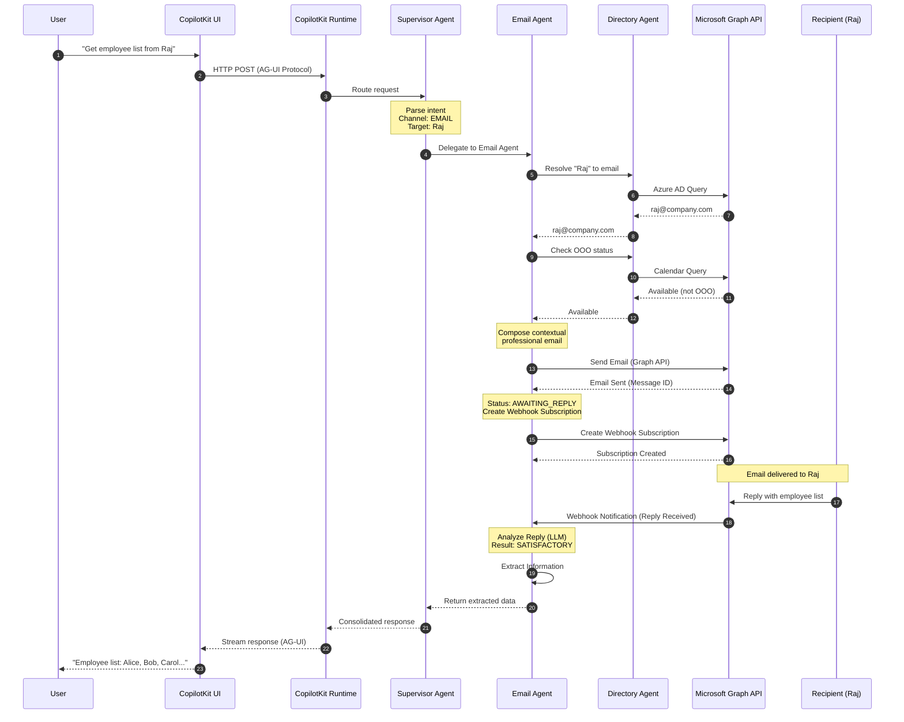
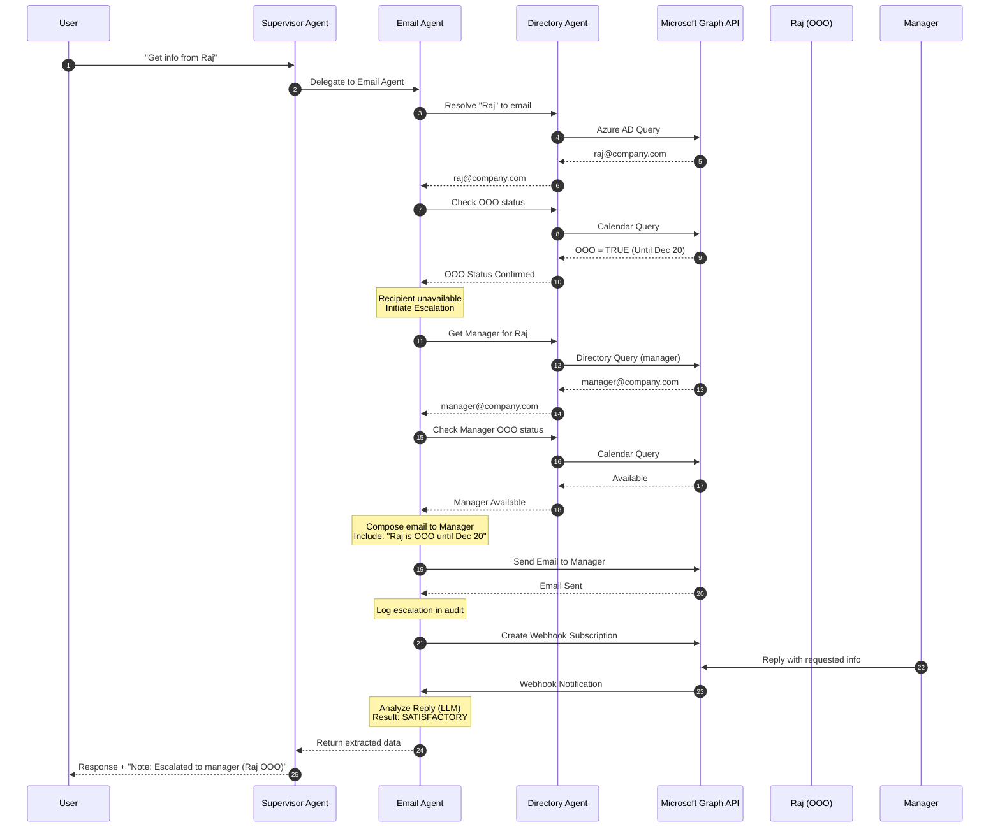
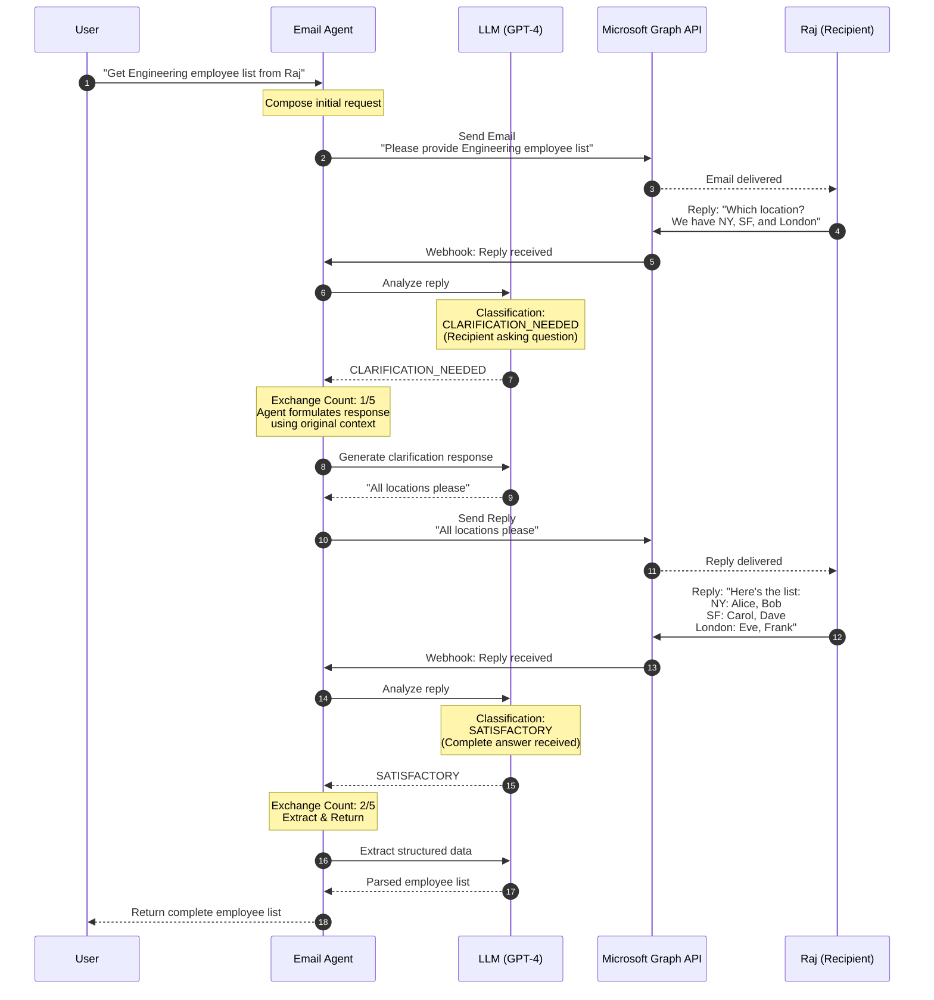
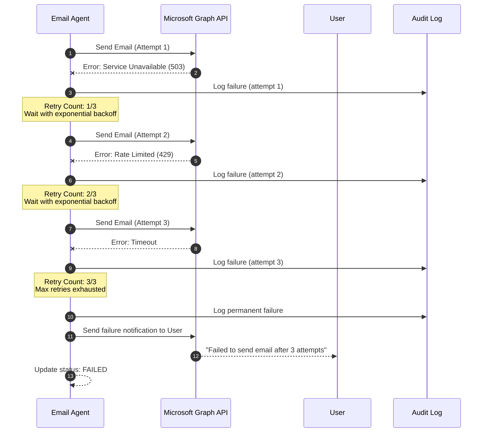
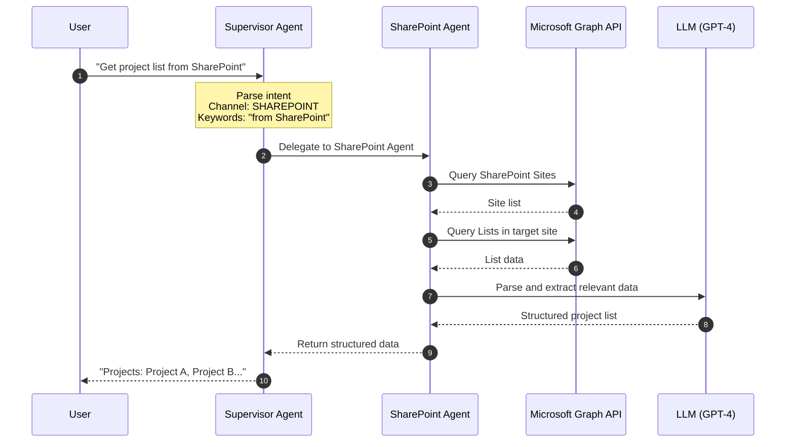
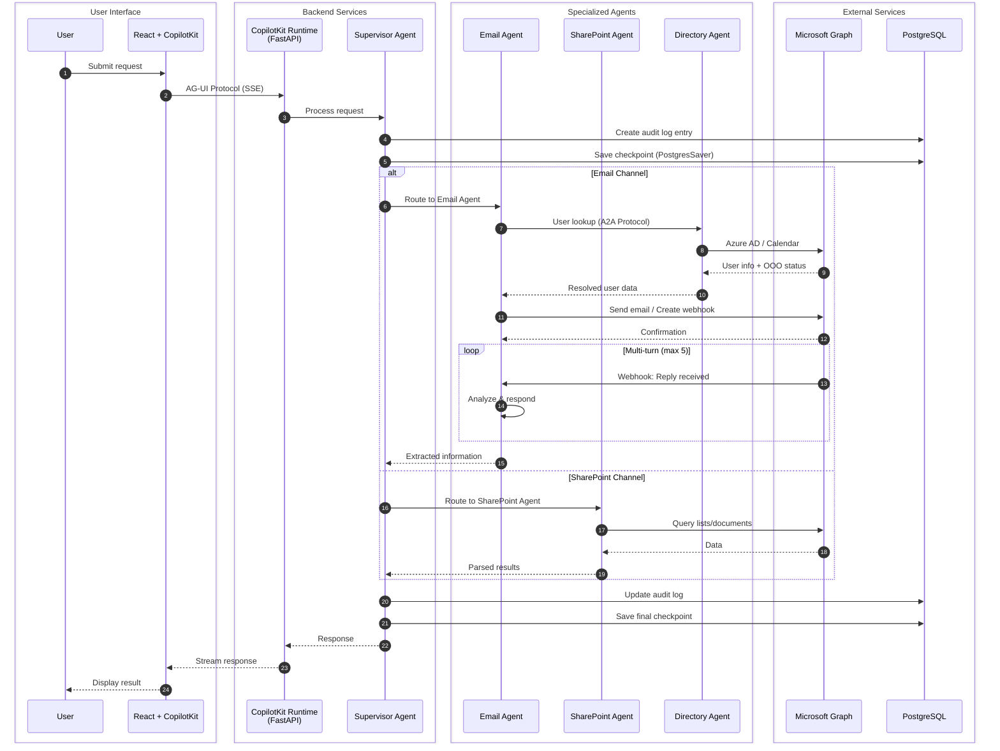
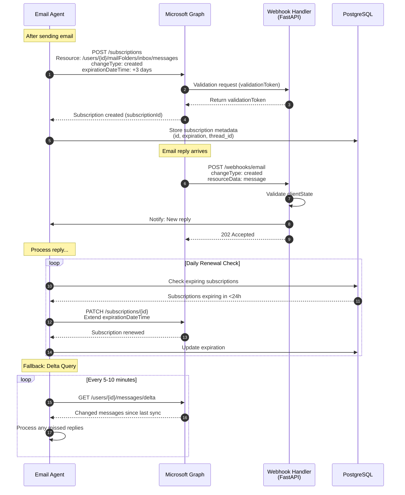

# Info-Agent: Sequence Flow Diagrams

This document contains detailed sequence diagrams for the Info-Agent system's core workflows.

---

## Table of Contents

1. [Email Channel - Happy Path](#1-email-channel---happy-path)
2. [Email Channel - Escalation Path (OOO)](#2-email-channel---escalation-path-ooo)
3. [Email Channel - Multi-Turn Conversation](#3-email-channel---multi-turn-conversation)
4. [Email Channel - Retry Flow](#4-email-channel---retry-flow)
5. [SharePoint Channel Flow](#5-sharepoint-channel-flow)
6. [Complete System Overview](#6-complete-system-overview)

---

## 1. Email Channel - Happy Path

This diagram shows the successful flow when a user requests information via email and receives a satisfactory response.

---

## 2. Email Channel - Escalation Path (OOO)

This diagram shows the flow when the target recipient is Out-of-Office and the system escalates to their manager.

---

## 3. Email Channel - Multi-Turn Conversation

This diagram shows autonomous multi-turn conversation handling when the recipient needs clarification.

---

## 4. Email Channel - Retry Flow

This diagram shows the retry mechanism when email sending fails.

---

## 5. SharePoint Channel Flow

This diagram shows the flow when a user explicitly requests information from SharePoint.

---

## 6. Complete System Overview

This diagram provides a high-level overview of all system components and their interactions.

---

## Webhook Lifecycle Sequence

This diagram details the webhook subscription management for email monitoring.

---

## Legend

| Symbol | Meaning |
|--------|---------|
| `->>`  | Synchronous request |
| `-->>` | Response |
| `--x`  | Failed request |
| `Note` | Important state or action |
| `alt`  | Alternative paths |
| `loop` | Repeated action |
| `box`  | Logical grouping |

---

## References

- [Architecture Document](./ARCHITECTURE.md)
- [LangGraph Documentation](https://www.langchain.com/langgraph)
- [Microsoft Graph API](https://learn.microsoft.com/en-us/graph/)
- [Mermaid Sequence Diagram Syntax](https://mermaid.js.org/syntax/sequenceDiagram.html)
